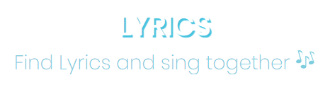

<h1 align="center">
    
</h1>

<h3 align="center">
  Find Lyrics developed with React e Redux: <a href="https://alineaferreira.github.io/findLyrics-react/" target="_blank">Live Demo</a>
</h3>


## Technologies

This project was developed with the following technologies:

-  [React Js](https://reactjs.org/)
-  [Redux](https://redux.js.org/)
-  [Styled-components](https://www.styled-components.com/)
-  [react-icons](https://react-icons.github.io/react-icons/)
-  [Axios](https://github.com/axios/axios)
-  [react-toastify](https://fkhadra.github.io/react-toastify/introduction/)
-  [VS Code](https://code.visualstudio.com/) with ESLint.


## How to use


```bash
# Clone this repository
$ git clone https://github.com/AlineAFerreira/findLyrics-react.git

# Access the folder
$ cd findLyrics-react

# Install dependencies
$ yarn install

# Run the app
$ yarn start

```


## License
This project is under the [MIT](https://choosealicense.com/licenses/mit/) license.
